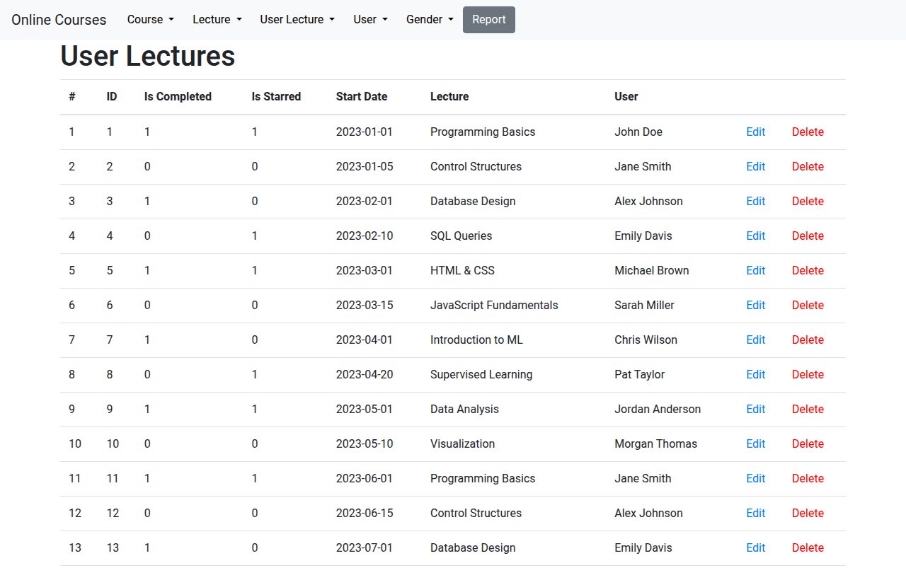
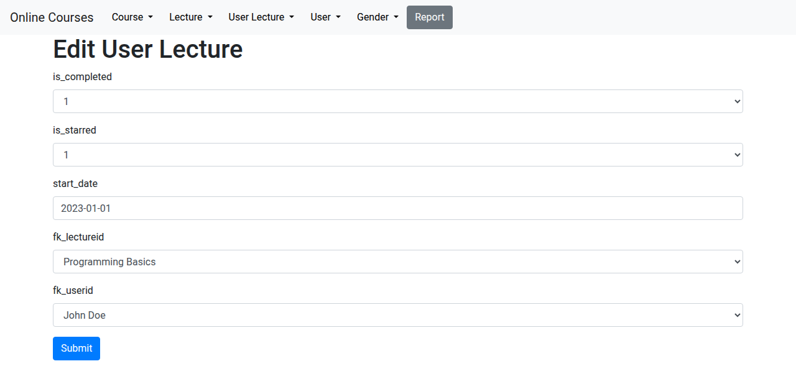
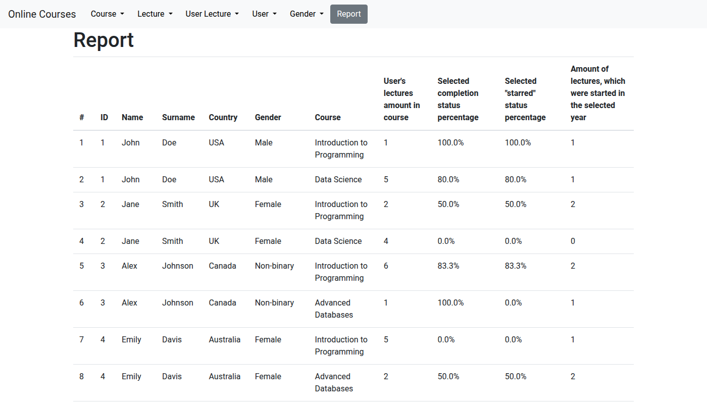

# flask-demo

Final project for the Databases course at KTU (first year). A small course-management web app
built to practise wiring a relational database to a web application: Flask + SQLite,
server-rendered with Jinja and Bootstrap, no ORM.

It manages users, courses, lectures and which lectures each user has taken, with generic
create / edit / delete pages generated from a lightweight model layer and a filterable
aggregate report.



## Running

```bash
pip install -r requirements.txt
python init_db.py      # creates database.db from schema.sql and initial_data.sql
python app.py          # http://127.0.0.1:5000
```

`init_db.py` drops and recreates the database, so rerun it to reset the sample data.

## What's inside

```
app.py            routes, template filters and the report query
DB_Classes.py     table models: Gender, User, Course, Lecture, UserLecture
data_entries.py   attribute descriptors (foreign keys, restricted values)
schema.sql        table definitions
initial_data.sql  sample data
init_db.py        (re)creates database.db
templates/        base layout, generic table / create / edit pages, report pages
```

### Data model

```
genders ──< users ──< user_lectures >── lectures >── courses
```

`user_lectures` is the join table; it also records whether a lecture was completed or starred
and when it was started. Deleting a user, lecture or course cascades to dependent rows.

### Generic CRUD

Each model is a class with a `table_name` and a tuple of `attributes`. An attribute is a plain
column name, a `foreignKey` (rendered as a dropdown of human-readable names from the referenced
table) or a `limitedVariantsDataEntry` (rendered as a dropdown of allowed values). The same
`table.html`, `create.html` and `edit.html` templates serve every table by inspecting the model
through Jinja filters, so adding a table means adding a class and a row in `classAdresses`.



The base `DB_class` implements `select`, `get`, `push`, `update` and `delete` with
parameterised SQL.

### Report

`/report` lists users with their lectures. Submitting the form filters by completion status,
starred status and start year and returns, per user and course: number of lectures, share of
lectures matching the selected completion and starred status, and how many lectures were started
in the chosen year — a single `GROUP BY` query with conditional aggregates.



## Notes

- Delete links are plain `GET` requests, which is convenient for a demo but not something to
  ship.
- `SECRET_KEY` is read from the environment and falls back to a development value.
